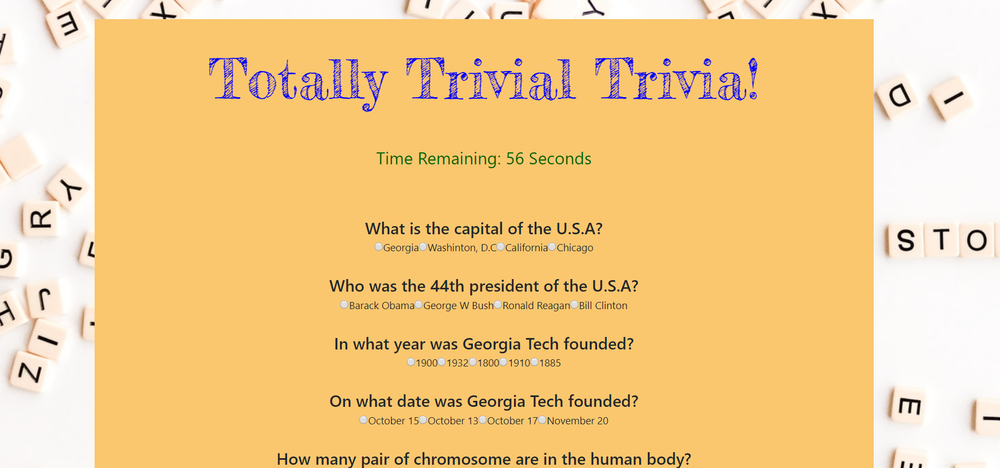

# TriviaGame

## Technology

- HTML5

- CSS3

- Bootstrap

- jQuery

- Googlefonts

## About App

- User gets to answer questions selected by the computer in a time frame

- Computer will display amount of questions passed and failed when time elapsed

## App View and Live Link

